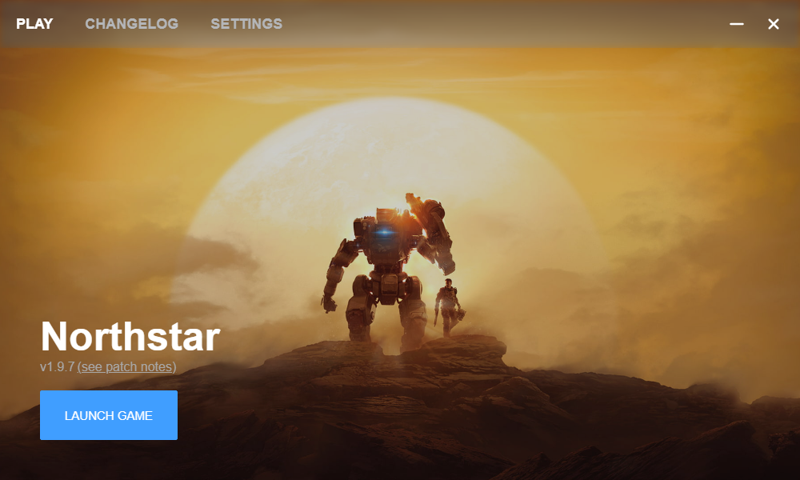

# FlightCore

A [Northstar](https://northstar.tf/) installer, updater, and soon to be mod-manager



## Roadmap

--> See https://github.com/GeckoEidechse/FlightCore/issues/1

## Development

Make sure you have the necessary dependencies installed: https://tauri.app/v1/guides/getting-started/prerequisites


Install `npm` dependencies with 

```sh
npm install
```

Install UI dependencies too

```sh
cd src-vue && npm install
```

Then for developing

```sh
npx tauri dev
```

> **Note**
> On Windows instead of `npm run ui-dev`, you may need to run 
> `./node_modules/.bin/rollup --config --watch`
> and
> `./node_modules/.bin/servor dist index.html 8080 --reload`
> in two separate console windows

### Tips

Note that you can adjust the behaviour of Tauri windows in `tauri.conf.json`, e.g.

```json
"windows": [
  {
    "fullscreen": false,
    "resizable": true,
    "alwaysOnTop": true,
    "x": 1200,
    "y": 0,
    "height": 500,
    "width": 300,
    "title": "FlightCore"
  }
]
```

### Building

Release builds are generally done via CI. To build locally, make sure typescript is compiled (`./node_modules/.bin/rollup --config`), then run `npm run tauri build`.

## Why yet another Northstar intaller/updater/mod-manager instead of contributing to an existing one?

The 3 main GUI tools for handling such tasks with Norhtstar are

- [r2modman](https://github.com/ebkr/r2modmanPlus)
- [Viper](https://github.com/0neGal/viper)
- [VTOL](https://github.com/BigSpice/VTOL)

while they get most of the work done, each of them has their own problem.

- **r2modman** has not too great UX and given that it also has to support other games there's not a(n easy) way to quickly add new features specific to Northstar
- **Viper** probably has the best UX but is missing features such as Origin process runtime detection (to avoid LSX errors) and lacks the ability to install Northstar from Thunderstore. Further there are still cases where JavaScript errors are not handled properly simply showing the stack trace and confusing users.
- **VTOL** has recently undergone a rewrite that removes a lot of older issues (such as requiring to be run as admin), however it is Windows exclusive and requires installing an additional library not shipped directly with the application, confusing some users. It also has a lot of edge case handling that while giving a smoother user experience blows up code base complexity.

With that said, FlightCore is not written from scratch. For handling Northstar specific logic, functions are re-used from the CLI-only Northstar installer called [papa](https://github.com/AnActualEmerald/papa) by making use of the underlying library [libthermite](https://crates.io/crates/libthermite).

The plan is to upstream any changes to `libthermite` so that it can be re-used by any other Rust-based Northstar installer.

## Additional info

Based on source code for the [Rust Tauri Introduction Video](https://www.youtube.com/watch?v=kRoGYgAuZQE&list=PL7r-PXl6ZPcCIOFaL7nVHXZvBmHNhrh_Q)
