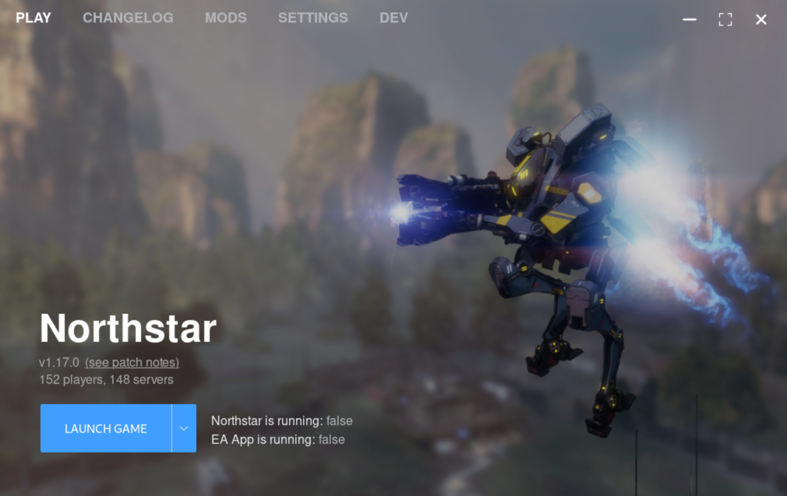

	
	 
	 
	
	 

# FlightCore

A [Northstar](https://northstar.tf/) installer, updater, and mod-manager

## Install

Downloads are available on the [releases page](https://github.com/R2NorthstarTools/FlightCore/releases).

**Windows:** Download `FlightCore_X.Y.Z_x64_en-US.msi` and then run the installer by double-clicking the file.

**Linux:** Download `flight-core_X.Y.Z_amd64.AppImage`, put it in a preferred location and make it executable. A Flatpak version is planned for the future.

All versions of FlightCore feature an auto-updater that will ask to self-update on new releases.

## Frequently Asked Questions (FAQ)

Answers to frequently asked questions can be found in [docs/FAQ.md](docs/FAQ.md)

## Development

If you'd like to contribute to FlightCore, see [docs/DEVELOPMENT.md](docs/DEVELOPMENT.md)

## Roadmap

--> See https://github.com/R2NorthstarTools/FlightCore/issues/1
