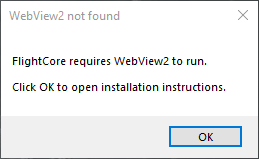
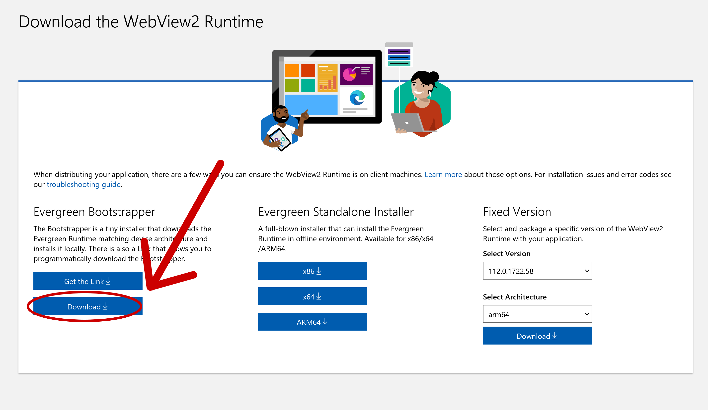

# Troubleshooting

Got an issue with FlightCore? Hopefully one of the steps below will help you resolve it. If not open an [issue on GitHub](https://github.com/R2NorthstarTools/FlightCore/issues/new) or ping `Gecko#7945` on the Northstar Discord.

## FlightCore won't launch

If you are on Windows and FlightCore won't start but instead shows an error message like this

that means that WebView2 is not installed. WebView2 is an embedded browser framework used by FlightCore to display its GUI.

To install it, you can grab the latest version from the Microsoft website: \
https://developer.microsoft.com/en-us/microsoft-edge/webview2/#download-section

(make sure to select _Evergreen Bootstrapper_ -> _Download_).

